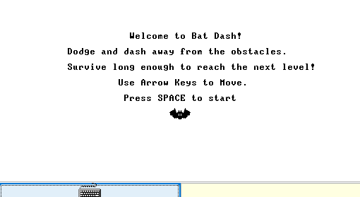
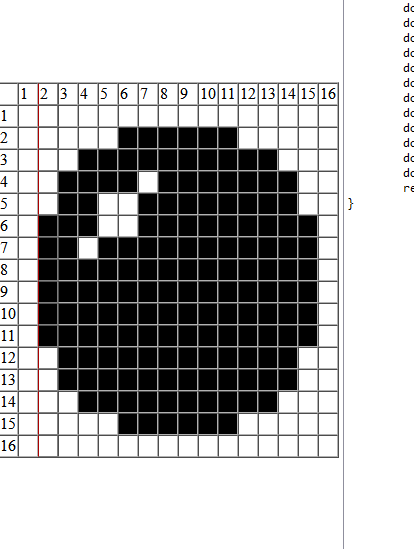

# Bat Dash

This is my Jack project for Nand2Tetris. Although the game loop is simple, I'm satisfied with how it performs. There are still areas for improvement. For instance, my RNG implementation could benefit from using a count of frames between player inputs as a seed, which I may revisit in the future.

---

## **Creating the Sprites**
To design the assets for this game, I used [Erik Umble's JackBitmapEditor](https://github.com/ErikUmble/JackBitmapEditor)

Here’s an example of creating the debris obstacle sprite:

---

# Jack OS API
**Source**: [Jack OS API, www.nand2tetris.org](http://www.nand2tetris.org)

The Jack language includes a collection of eight built-in classes that extend the language's capabilities, essentially forming a basic operating system. This document provides the API reference for each of these classes.

## Contents

- [Jack OS API](#jack-os-api)
- [Error Codes](#error-codes)
- [Math](#math)
- [String](#string)
- [Array](#array)
- [Output](#output)
- [Screen](#screen)
- [Keyboard](#keyboard)
- [Memory](#memory)
- [Sys](#sys)

---

## Math
[Return to Contents](#contents)

The `Math` class is a library of commonly used mathematical functions. These functions are built into the Jack language and are used by the compiler to handle arithmetic operations directly.

- `function int multiply(int x, int y)`: Returns the product of `x` and `y`. When a Jack compiler detects the multiplication operator `*` in the code, it invokes this method. Thus, `x * y` and `Math.multiply(x, y)` return the same value.

- `function int divide(int x, int y)`: Returns the integer part of `x / y`. When the compiler detects the division operator `/`, it invokes this method. Therefore, `x / y` and `Math.divide(x, y)` return the same result.

- `function int min(int x, int y)`: Returns the minimum of `x` and `y`.

- `function int max(int x, int y)`: Returns the maximum of `x` and `y`.

- `function int sqrt(int x)`: Returns the integer part of the square root of `x`.

---

## String
[Return to Contents](#contents)

The `String` class represents character strings and includes a variety of methods for typical string operations. It allows constructing and disposing of strings, setting individual characters, erasing the last character, appending characters, and other common operations on strings.

- `constructor String new(int maxLength)`: Constructs a new empty string with a maximum length of `maxLength` and an initial length of 0.

- `method int dispose()`: Disposes of this string.

- `method int length()`: Returns the current length of this string.

- `method char charAt(int j)`: Returns the character at the `j`-th location of this string.

- `method void setCharAt(int j, char c)`: Sets the character at the `j`-th location to `c`.

- `method String appendChar(char c)`: Appends `c` to the end of this string and returns the string.

- `method void eraseLastChar()`: Erases the last character from this string.

- `method int intValue()`: Returns the integer value of this string until a non-digit character is detected.

- `method void setInt(int val)`: Sets this string to hold a representation of the given integer value.

- `function char backSpace()`: Returns the backspace character.

- `function char doubleQuote()`: Returns the double quote (`"`) character.

- `function char newLine()`: Returns the newline character.

---

## Array
[Return to Contents](#contents)

The `Array` class represents an array in the Jack language. Arrays in Jack are instances of this class. Once declared, each array entry can be accessed using the usual syntax, such as `arr[i]`. Each entry can hold a primitive data type or an object, and different entries may hold different data types.

- `function Array new(int size)`: Constructs a new array of the specified size.

- `method void dispose()`: Disposes of this array.

---

## Output
[Return to Contents](#contents)

The `Output` class provides functions for displaying text on the screen. The Hack physical screen consists of 256 rows of 512 pixels each. The library uses a fixed font, in which each character is displayed within a frame which is 11 pixels high (including 1 pixel for inter-line spacing) and 8 pixels wide (including 2 pixels for inter-character spacing). The resulting grid accommodates 23 rows (indexed 0..22, top to bottom) of 64 characters each (indexed 0..63, left to right). The top left character position on the screen is indexed (0,0). A cursor, implemented as a small filled square, indicates where the next character will be displayed.

- `function void moveCursor(int i, int j)`: Moves the cursor to the `j`-th column of the `i`-th row and erases any character displayed at that location.

- `function void printChar(char c)`: Displays the specified character at the cursor location and advances the cursor by one column.

- `function void printString(String s)`: Displays the specified string starting at the cursor location and advances the cursor accordingly.

- `function void printInt(int i)`: Displays the specified integer at the cursor location and advances the cursor.

- `function void println()`: Advances the cursor to the beginning of the next line.

- `function void backSpace()`: Moves the cursor one column back.

---

## Screen
[Return to Contents](#contents)

The `Screen` class provides functions for displaying graphics on the screen. The Hack physical screen consists of 256 rows (indexed 0..255, top to bottom) of 512 pixels each (indexed 0..511, left to right). The top left pixel on the screen is indexed (0,0). This class offers functions to draw pixels, lines, rectangles, and circles on the screen using a set color.

- `function void clearScreen()`: Erases the entire screen.

- `function void setColor(boolean b)`: Sets the current drawing color: `true` for black, `false` for white.

- `function void drawPixel(int x, int y)`: Draws a pixel at coordinates `(x, y)` using the current color.

- `function void drawLine(int x1, int y1, int x2, int y2)`: Draws a line from `(x1, y1)` to `(x2, y2)`.

- `function void drawRectangle(int x1, int y1, int x2, int y2)`: Draws a filled rectangle from `(x1, y1)` to `(x2, y2)` using the current color.

- `function void drawCircle(int x, int y, int r)`: Draws a filled circle with radius `r` centered at `(x, y)`.

---

## Keyboard
[Return to Contents](#contents)

The `Keyboard` class allows reading inputs from a standard keyboard. It can recognize all ASCII characters as well as special keys.

- `function char keyPressed()`: Returns the character of the currently pressed key on the keyboard; if no key is currently pressed, returns `0`. Recognizes all ASCII characters, as well as the following  keys: newline (`128=String.newline()`), backspace (`129=String.backspace()`), left arrow (`130`), up arrow (`131`), right arrow (`132`), down arrow (`133`), home (`134`), end (`135`), page up (`136`), page down (`137`), insert (`138`), delete (`139`), ESC (`140`), F1-F12 (`141-152`).

- `function char readChar()`: Waits until a key is pressed and released, then echoes the key to the screen and returns the character of the pressed key.

- `function String readLine(String message)`: Displays `message` on the screen, reads text from the keyboard until a newline is detected, echoes the text to the screen, and returns its value. It also handles backspaces.

- `function int readInt(String message)`: Displays `message`, reads from the keyboard until a newline, and returns the entered integer value (until a non-digit character is detected). Also handles backspaces.

---

## Memory
[Return to Contents](#contents)

The `Memory` class provides two services: direct access to the computer's main memory (RAM) and allocation and recycling of memory blocks. The Hack RAM consists of 32,768 words, each holding a 16-bit binary number.

- `function int peek(int address)`: Returns the RAM value at the specified address.

- `function void poke(int address, int value)`: Sets the RAM value at the specified address to `value`.

- `function Array alloc(int size)`: Allocates a RAM block of the specified size and returns a reference to its base address.

- `function void deAlloc(Array o)`: De-allocates the specified memory block, making it available for future allocations.

---

## Sys
[Return to Contents](#contents)

The `Sys` class provides system-level program execution services.

- `function void halt()`: Halts the program execution.

- `function void error(int errorCode)`: Displays the error code in the format `"ERR<errorCode>"` and halts the program.

- `function void wait(int duration)`: Pauses program execution for approximately `duration` milliseconds.

---

## Error Codes
[Return to Contents](#contents)

| Code | Method/Function       | Description                                     |
|------|------------------------|-------------------------------------------------|
| 1    | Sys.wait              | Duration must be positive                       |
| 2    | Array.new             | Array size must be positive                     |
| 3    | Math.divide           | Division by zero                                |
| 4    | Math.sqrt             | Cannot compute square root of a negative number |
| 5    | Memory.alloc          | Allocated memory size must be positive          |
| 6    | Memory.alloc          | Heap overflow                                   |
| 7    | Screen.drawPixel      | Illegal pixel coordinates                       |
| 8    | Screen.drawLine       | Illegal line coordinates                        |
| 9    | Screen.drawRectangle  | Illegal rectangle coordinates                   |
| 12   | Screen.drawCircle     | Illegal center coordinates                      |
| 13   | Screen.drawCircle     | Illegal radius                                  |
| 14   | String.new            | Maximum length must be non-negative             |
| 15   | String.charAt         | String index out of bounds                      |
| 16   | String.setCharAt      | String index out of bounds                      |
| 17   | String.appendChar     | String is full                                  |
| 18   | String.eraseLastChar  | String is empty                                 |
| 19   | String.setInt         | Insufficient string capacity                    |
| 20   | Output.moveCursor     | Illegal cursor location                         |
