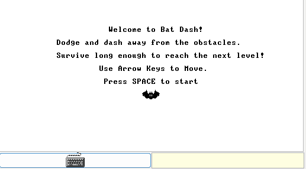
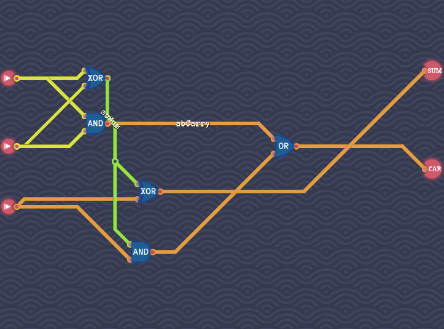
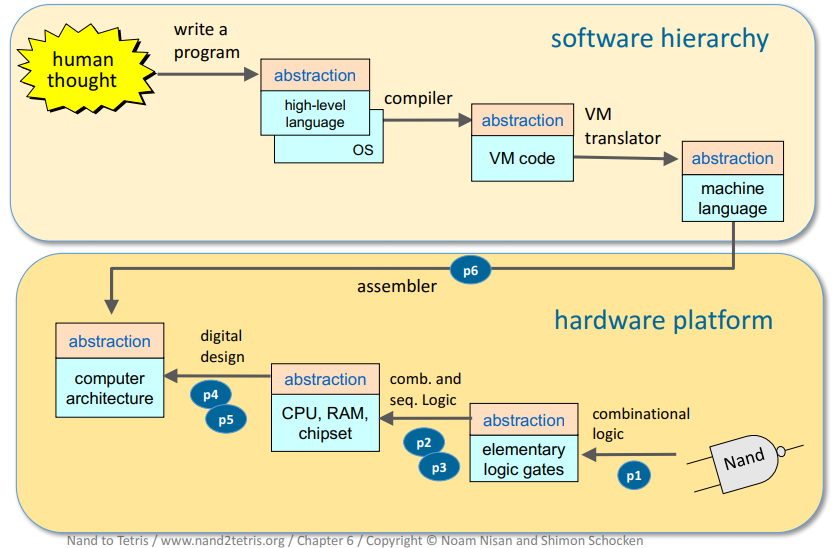

## Table of Contents
- [Course Overview](#course-overview)
- [Projects](#projects)

# Nand2Tetris Projects

This repository showcases my journey through the [Nand2Tetris course](https://www.nand2tetris.org/), which I completed through [Coursera](https://www.coursera.org/). In this course, I built a computer from scratch, starting with basic logic gates and ending with a functioning 16-bit computer, assembler, virtual machine, and compiler. You can watch a video about the course from the creators [here](https://youtu.be/wTl5wRDT0CU?si=jGkVxLfca3-5Y_mm).

## **What is Nand2Tetris?**
Nand2Tetris is an extraordinary course that starts from the simplest building block of a computer, a NAND gate, and guides you to build:
- A 16-bit CPU.
- A complete memory system.
- The Hack computer, a 16-bit computer architecture.
- An assembler.
- A virtual machine.
- A compiler for a high-level programming language.
- Lastly, an operating system.

By the end, the computer can run programs like Tetris and custom creations, including my own [**Bat Dash**](./BatDash/) game, written in a high-level language we compile ourselves.

### **Bat Dash Demo**
Here is what my **Bat Dash** game looks like running on the Hack Computer's 512x256 1-bit pixel screen. This game was written in the Jack Language, which we learn in the course.



---

## **Course Overview**
The Nand2Tetris course is divided into two parts:

### **Part 1: Building a Modern Computer from First Principles**
In Part 1, I designed and implemented:
- **NAND Gate**: The foundation of all other logic gates.
- **Logic Gates**: AND, OR, NOT, XOR, Multiplexers, and more, all built using only NAND gates.
- **16-bit ALU (Arithmetic Logic Unit)**: The "brain" of the computer, capable of performing arithmetic and logic operations.
- **Registers and Memory**: From basic flip-flops to a 16-bit RAM capable of storing data and instructions.
- **16-bit CPU**: A central processing unit designed to execute [machine instructions.](./assets/hack_computer_instructions.png)
- **Hack Computer**: A fully functional 16-bit computer capable of running assembly code.
- **Hack Assembler**: Translates assembly code written for the Hack computer into machine code that the Hack hardware platform can execute.

**Part 1 Milestone**: By the end of this section, I created a simulator-ready computer that could execute simple programs in the Hack assembly language.

_Note: To respect the spirit of learning from this course, I have chosen not to provide the full HDL code for the hardware implementations._

---

### Example of HDL code
```verilog
/**
 * Computes the sum of three bits.
 */

CHIP FullAdder {
    IN a, b, c;  // 1-bit inputs
    OUT sum,     // Right bit of a + b + c
        carry;   // Left bit of a + b + c
    PARTS:
    HalfAdder(a=a, b=b, sum=abSum, carry=abCarry);
    HalfAdder(a=abSum, b=c, sum=sum, carry=cSumCarry);
    Or(a=abCarry, b=cSumCarry, out=carry);
}
```

```verilog
/**
 * Computes the sum of two bits.
 */
CHIP HalfAdder {
    IN a, b;    // 1-bit inputs
    OUT sum,    // Right bit of a + b 
        carry;  // Left bit of a + b
    PARTS:
    Xor(a=a, b=b, out=sum);
    And(a=a, b=b, out=carry);

}
```


### **Full Adder Example**
Full Adder Example I've made from [Turing Complete](https://youtu.be/-YY73ejihZo?si=fd_FrdXgwuKLPJTB) I highly recommend.



---

### **Part 2: Building a Compiler and Operating System**
In Part 2, I moved into the software layer, creating tools and systems that run on the Hack Computer:
- **Virtual Machine Translator**: Translates stack-based virtual machine code into Hack assembly.
- **Jack Compiler**: A compiler for the high-level Jack programming language, capable of translating Jack programs into VM code.
- **Operating System**: Built essential libraries and functions to for drawing to the screen, allocating memory, math, etc.

**Part 2 Milestone**: The Hack Computer could now run high-level programs compiled using my tools, including my custom **Bat Dash** game.

---

## **Projects**
Below are the key projects I completed during this course:

- [**Hack Assembler**](https://github.com/d-holguin/hack-assembler):  
  A tool to translate Hack assembly code into binary machine language that the Hack computer can execute. Written in **Rust**.

- [**VM Translator**](./VMTranslator):  
  A translator that converts high-level VM (Virtual Machine) commands into Hack assembly. Implemented in **Go**, chosen to explore a new language.

- [**Jack Compiler**](./JackCompiler):  
  A compiler that translates high-level Jack code into VM code. Written in **Java**.

- [**Bat Dash**](./BatDash):  
  Using the Jack Programming Language made for the Hack computer platform, I created a simple dash game with animated sprites on the 512x256 1-bit pixel screen of the Hack computer. While this game is very simple, it was somewhat complex to implement on such a basic computer. The RNG logic was created from scratch and could use some improvements, but I'm satisfied with how the sprite animations turned out for the playable bat and the obstacles it dodges. 

---


## **Big Picture**


### **Acknowledgments**
A huge thank you to Noam Nisan and Shimon Schocken, the creators of this course [nand2tetris.org](https://www.nand2tetris.org/).

---

This repository is licensed under an Academic Use Restricted License. Please see the LICENSE file for details.
